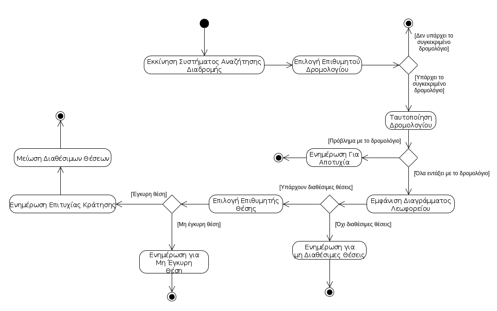
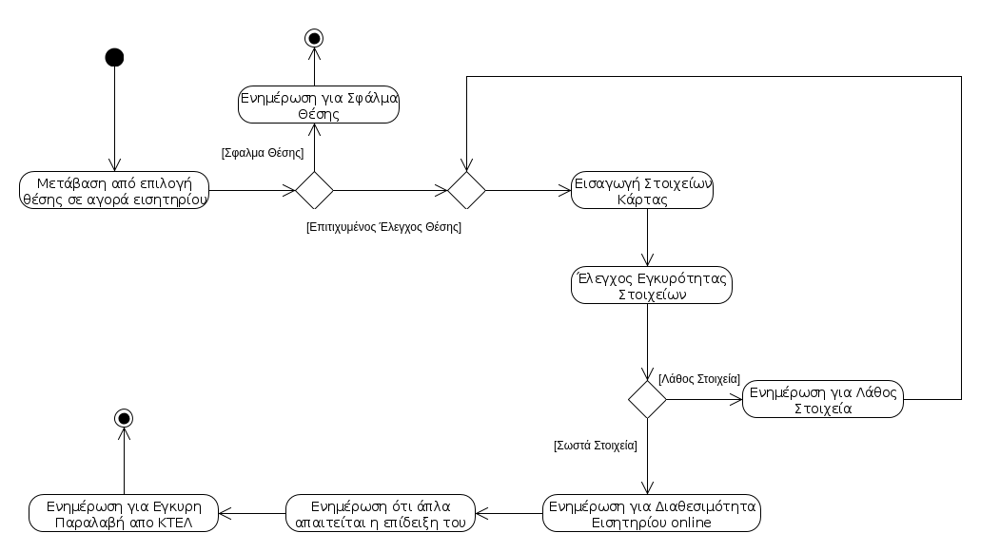
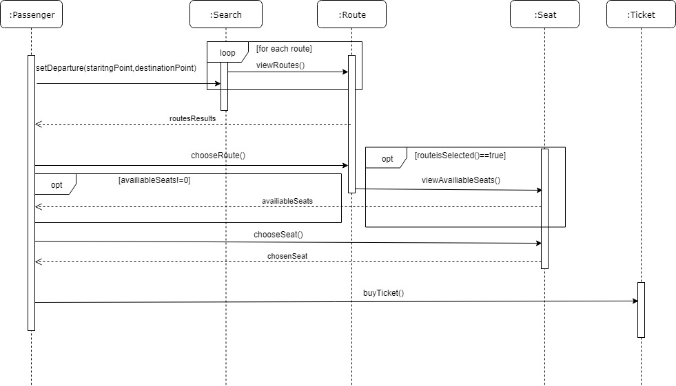
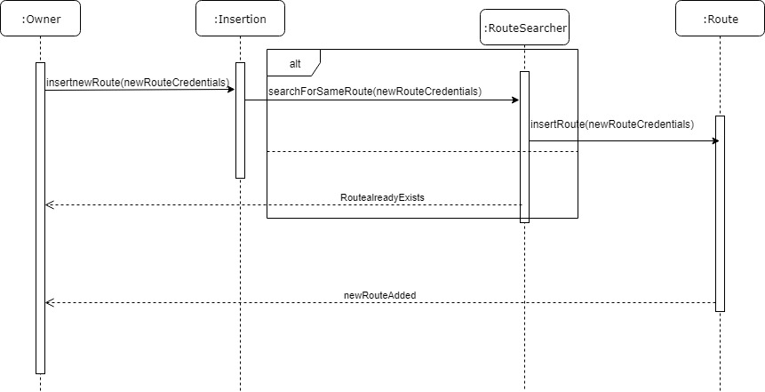

# &nbsp;&nbsp;&nbsp;&nbsp;&nbsp;&nbsp;&nbsp;&nbsp;&nbsp;&nbsp;&nbsp;&nbsp;&nbsp;&nbsp;&nbsp;&nbsp;&nbsp;&nbsp;&nbsp;&nbsp;&nbsp;&nbsp;&nbsp;&nbsp; R2 ΑΠΑΙΤΗΣΕΙΣ ΛΟΓΙΣΜΙΚΟΥ / ΑΝΑΛΥΣΗ ΣΥΣΤΗΜΑΤΟΣ
### 2.1 ΔΗΜΙΟΥΡΓΙΑ ΜΟΝΤΕΛΟΥ ΠΕΡΙΠΤΩΣΕΩΝ ΧΡΗΣΗΣ 

### &nbsp;&nbsp;&nbsp;&nbsp;&nbsp;&nbsp;&nbsp;&nbsp;&nbsp;2.1.1 Διάγραμμα περιπτώσεων χρήσης (use case diagram) 

### &nbsp;&nbsp;&nbsp;&nbsp;&nbsp;&nbsp;&nbsp;&nbsp;&nbsp;2.1.2. Περιγραφή περιπτώσεων χρήσης. 
__Περίπτωση Χρήσης:  Έκδοση Εισητηρίου__
__Σύντομη Περιγραφή:__ Αυτή η περίπτωση χρήσης επιτρέπει σ΄ έναν υπάλληλο τδφου ΚΤΕΛ να αναζητήσει στο σύστημα έναν επιβάτη, ο οποίος έχει πληρώσει με κάρτα και να εκδόσει το αντίστοιχο εισητήριο.
__Πρωτεύον Actor:__ Υπάλληλος ΚΤΕΛ
__Ενδιαφερόμενοι:__ Επιβάτης
__Προϋποθέσεις:__ O επιβάτης δηλώνει ότι είναι έτοιμος να παραλάβει το εισητήριο, διαθέτει έγκυρη αγορά online και διαθέτει τα απαραίτητα στοιχεία ταυτοποίησης  και στοιχεία αγοράς.
__Βασική Ροή:__ 
1.	Ο επιβάτης έρχεται στον υπάλληλο του ΚΤΕΛ έχοντας μαζί του στοιχεία ταυτοποίησης και αγοράς.
2.	Ο υπάλληλος του ΚΤΕΛ αναζητά τον επιβάτη.
3.	Το Σύστημα παρουσιάζει τα στοιχεία του επιβάτη.
4.	Ο υπάλληλος αναζητά το εισητήριο.
5.	Το Σύστημα παρουσιάζει τα στοιχεία του εισητηρίου.
6.	Ο υπάλληλος επιλέγει το εισητήριο για έκδοση.
7.	Το Σύστημα επιβεβαιώνει ότι ο επιβάτης έχει έγκυρη πληρωμή και μπορεί να παραλάβει το εισητήριο.
8.	Ο υπάλληλος ενημερώνει το σύστημα ότι ο επιβάτης έχει παραλάβει το εισητήριο.
9.	Ο υπάλληλος εκδίδει το εισητήριο.
10.	Ο πελάτης παίρνει το εισητήριο.

__Εναλλακτικές Ροές:__ 
__*Σε οποιοδήποτε σημείο το λογισμικό καταρρέει:__
1.	Ο υπάλληλος εκκινεί το Σύστημα.
2.	Το Σύστημα ταυτοποιεί τον υπάλληλο.
3.	Ο υπάλληλος συνεχίζει την έκδοση εισητηρίου από εκεί που τερματίστηκε.

5α. Το σύστημα δεν μπορεί να βρει το εισητήριο του επιβάτη.
        
1.	Το σύστημα ενημερώνει τον υπάλληλο ότι η διαδικασία αναζήτησης δεν     ολοκληρώθηκε με επιτυχία.
2.	Ο υπάλληλος του ΚΤΕΛ αναζητάει ξανά το εισητήριο του επιβάτη.
                    a.	Η διαδικασία αποτυγχάνει ξανά.
                    b.	Η διαδικασία έκδοσης τερματίζει.
 
__Περίπτωση Χρήσης:  Στατιστικά Στοιχεία__
__Σύντομη Περιγραφή:__ Αυτή η περίπτωση χρήσης επιτρέπει σ' έναν ιδιοκτήτη ΚΤΕΛ να μπορεί να δει στατιστικά στοιχεία πληρότητας των διάφορων δρομολογίων.
__Πρωτεύον Actor:__ Ιδιοκτήτης ΚΤΕΛ
__Ενδιαφερόμενοι:__  Ιδιοκτήτης ΚΤΕΛ
__Προϋποθέσεις:__ Ο ιδιοκτήτης ΚΤΕΛ δηλώνει ότι είναι έτοιμος να παραλάβει τα στατιστικά στοιχεία πληρότητας δρομολογίων αφού πρώτα το σύστημα έχει συλλέξει τον απαραίτητο αριθμό δεδομένων για να παραχθούν τα στατιστικά στοιχεία.
__Βασική Ροή:__
1.	Ο ιδιοκτήτης ανοίγει το Σύστημα(πλατφόρμα) παραγωγής στατιστικών στοιχείων.
2.	Ο ιδιοκτήτης επιλέγει δρομολόγια των οποίων θέλει να δει τα στατιστικά στοιχεία.
3.	Το Σύστημα αναζητά τα δρομολόγια.
4.	Το Σύστημα επεξεργάζεται και παράγει τα δεδομένα.
5.	Το Σύστημα εμφανίζει τα στατιστικά στοιχεία στον ιδιοκτήτη.
6.	Ο ιδιοκτήτης αξιοποιεί τις πληροφορίες που έλαβε.

__Εναλλακτικές Ροές:__
__*Σε οποιοδήποτε σημείο το λογισμικό καταρρέει:__
   1.	Ο ιδιοκτήτης εκκινεί το Σύστημα.
    2.	Το Σύστημα ταυτοποιεί τον ιδιοκτήτη.
    3.	Ο ιδιοκτήτης συνεχίζει τη διαδικασία από εκεί που τερματίστηκε.

3α. Το Σύστημα δεν μπορεί να βρεί τα δρομολόγια.
1.	Το Σύστημα ενημερώνει τον ιδιοκτήτη ότι η αναζήτηση απέτυχε.
 2.	Η διαδικασία παραγωγής στατιστικών στοιχείων τερματίζει.
         
4α. Το Σύστημα δεν μπορεί να συλλέξει τα δεδομένα.
    
1.	Το Σύστημα ενημερώνει τον ιδιοκτήτη ότι η επεξεργασία και παραγωγή             δεδομένων απέτυχε.
2.	Η διαδικασία παραγωγής στατιστικών στοιχείων τερματίζει.

__Περίπτωση Χρήσης:__ Παρακολούθηση Δρομολογίου
__Σύντομη Περιγραφή:__ Αυτή η περίπτωση χρήσης επιτρέπει σ' έναν επιβάτη να μπορεί να δει πληροφορίες για το δρομολόγιό του και να δεί αναμενόμενη ώρα άφιξης στον προορισμό
__Πρωτεύον Actor:__ Επιβάτης
__Ενδιαφερόμενοι:__ Επιβάτης
__Προϋποθέσεις:__ Ο επιβάτης δηλώνει ότι είναι έτοιμος να παραλάβει τις πληροφορίες σχετικά με το δρομολόγιό του,δεδομένου ότι το λεωφορείο έχει ξεκινήσει το ταξίδι.
Βασική Ροή:
1.	Ο επιβάτης ανοίγει το σύστημα παρακολούθησης του δρομολογίου του.
2.	Ο επιβάτης επιλέγει το δρομολόγιο που τον ενδιαφέρει. 
3.	Το σύστημα ταυτοποιεί το δρομολογίο του επιβάτη.
4.	Ο επιβάτης στην συνέχεια επιλέγει τον προορισμό του.
5.	Το σύστημα ενημέρωνει τον επιβάτη για το χρόνο που χρειάζεται το ΚΤΕΛ να φτάσει στον επιλεγμένο προορισμό. 

__Εναλλακτικές Ροές:__
__*Σε οποιοδήποτε σημείο το λογισμικό καταρρέει:__
1.	Ο επιβάτης εκκινεί το Σύστημα.
2.	Το Σύστημα ταυτοποιεί τα στοιχεία δρομολογίου που του έδωσε ο επιβάτης. 
3. Ο επιβάτης συνεχίζει τη διαδικασία από εκεί που τερματίστηκε.
   
 2α. Ο επιβάτης δεν μπορεί να βρεί το δρομολόγιο που τον ενδιαφέρει.
1.	Η διαδικασία τερματίζει.
    
3α. Το Σύστημα δεν μπορεί να ταυτοποιήσει το δρομολόγιο που επέλεξε ο επιβάτης.
 1.	Το Σύστημα ενημερώνει τον επιβάτη ότι η ταυτοποίηση δρομολογίου                απέτυχε.
2.	Η διαδικασία τερματίζει.

5α. Το Σύστημα δεν μπορεί να ενημερώσει τον επιβάτη για τον αναμενόμενο χρόνο άφιξης.

 1.	Το Σύστημα ενημερώνει τον επιβάτη ότι διαδικασία εκτίμησης αναμενόμενου χρόνου απέτυχε.
2.	Η διαδικασία τερματίζει.

__Περίπτωση Χρήσης:__ Καταχώρηση Δρομολογίου
__Σύντομη Περιγραφή:__ Αυτή η περίπτωση χρήσης επιτρέπει σ' έναν ιδιοκτήτη ΚΤΕΛ να δημιουργήσει ένα νέο δρομολόγιο προκειμένου να μπορέσει να εξυπηρετήσει καλύτερα τους επιβάτες.  
__Πρωτεύον Actor:__ Ιδιοκτήτης ΚΤΕΛ
__Ενδιαφερόμενοι:__ Πελάτες
__Προϋποθέσεις:__ Ο ιδιοκτήτης ΚΤΕΛ δηλώνει ότι είναι έτοιμος να προσθέσει ένα νέο δρομολόγιο αφού πρώτα έχει βρεί διαθέσιμο οδηγό και λεωφορείο, καθώς επίσης έχει αποφασίσει και τη διαδρομή την οποία θα κάνει. 
__Βασική Ροή :__
1.	Ο ιδιοκτήτης ανοίγει το Σύστημα(πλατφόρμα καταχώρησης νεων δρομολογίων) έχοντας έτοιμα τα νέα στοιχεία(δηλαδή του δρομολόγιου) που θέλει να καταχωρήσει.
2.	Ο ιδιοκτήτης αναζητά διαθέσιμη ώρα, διαδρομή και οδηγό προκειμένου να εφαρμόσει το νέο του δρομολόγιο.
3.	Το Σύστημα εμφανίζει τους διαθέσιμους οδηγούς καθώς επίσης και τα διαθέσιμα 
λεωφορεία που μπορεί να αξιοποιήσει.
4.	Ο ιδιοκτήτης αναζητά τα υπάρχοντα δρομολόγια προκειμένου να σιγουρευτεί ότι δεν υπάρχει ήδη το δρομολόγιο που πρόκειται να καταχωρήσει.
5.	Το Σύστημα εμφανίζει τα ήδη καταχωρημένα δρομολόγια.
6.	Ο ιδιοκτήτης επιλέγει τελικά το λεωφορείο, τον οδηγό, τη διαδρομή και την ώρα που θα ξεκινήσει το νέο του δρομολόγιο.
7.	Το Σύστημα επιβεβαιώνει ότι τα στοιχεία που εισήχθησαν είναι εντελώς έγκυρα και το δρομολόγιο μπορεί να εκτελεστεί κανονικά.
8.	Το Σύστημα κατοχυρώνει τελικά το νέο δρομολόγιο και το εμφανίζει διαθέσιμο προς
επιλογή.
9.	Ο ιδιοκτήτης ενημερώνεται ότι το αίτημά του(δηλαδή για την καταχώρηση ενός νέου
δρομολογίου) ότι υλοποιήθηκε με επιτυχία.

__Εναλλακτικές Ροές:__
__*Σε οποιαδήποτε σημείο το λογισμικό καταρρέει:__
1.	Ο ιδιοκτήτης εκκινεί το Σύστημα.
2.	Το Σύστημα ταυτοποιεί τον ιδιοκτήτη ΚΤΕΛ.
3.	Ο ιδιοκτήτης ΚΤΕΛ εκκινεί ξανά τη διαδικασία καταχώρησης ενός δρομολογίου προκειμένου να ολοκληρωθεί επιτυχώς αυτή τη φορά η διαδικασία.

3α. Το σύστημα αδυνατεί να βρει διαθέσιμους οδηγούς καθώς επίσης και διαθέσιμα 
λεωφορεία που μπορεί να αξιοποιήσει.
1.	  Ο ιδιοκτήτης δεν λαμβάνει τα αποτελέσματα που ζητάει κατά την  
              αναζήτησή του(για τους οδηγούς,τα λεωφορεία κτλ).
1α. Το σύστημα κρατά  την αναζήτηση για να διαπιστώσει το σφάλμα αργότερα.
 2.   Η αναζήτηση τερματίζεται
 
5α. Το σύστημα αδυνατεί να βρει τα ήδη καταχωρημένα δρομολόγια.
       
1.    Ο ιδιοκτήτης δεν λαμβάνει τα αποτελέσματα που ζητάει κατά την  
              αναζήτησή του(τα υπάρχοντα δρομολόγια).
        1α. Το σύστημα κρατά  την αναζήτηση για να διαπιστώσει το σφάλμα αργότερα.
2. Η αναζήτηση τερματίζεται.

7α. Ο ιδιοκτήτης ΚΤΕΛ δεν μπορεί να καταχωρήσει ένα νέο δρομολόγιο
1.	Το Σύστημα ενημερώνει τον ιδιοκτήτη ΚΤΕΛ ότι η διαδικασία δεν ολοκληρώθηκε 
με επιτυχία.
2.	Απελευθερώνει-αποδεσμεύει το λεωφορείο και τον οδηγό που επιλέχθηκαν(για το νέο δρομολόγιο) προκειμένου να φαίνονται διαθέσιμοι για πιθανόν μεταγενέστερη καταχώρηση δρομολογίου από τον ίδιο ή από άλλον ιδιοκτήτη ΚΤΕΛ.
3. Η καταχώρηση ενός νέου δρομολογίου τερματίζει.

8α. Το σύστημα αδυνατεί να καταχωρήσει το νέο δρομολόγιο.
1.	Ο ιδιοκτήτης ΚΤΕΛ ενημερώνεται για την αδυναμία καταχώρησης   
              του νέου δρομολογίου.
2.	Αποδεσμεύεται κάθε πόρος(ανθρώπινος - υλικός) που είχε ζητηθεί 
             από τον ιδιοκτήτη ΚΤΕΛ προκειμένου να καταχωρήσει το νέο του Δρομολόγιο.
3.	 Η διαδικασία καταχώρησης νέου δρομολογίου τερματίζει.

    
__Περίπτωση Χρήσης:__ Αναζήτηση 
__Σύντομη περιγραφή:__ Αυτή η περίπτωση χρήσης επιτρέπει σε έναν χρήστη να κάνει αναζήτηση δρομολογίων βλέποντας τα αναλυτικά στοιχεία της κάθε διαδρομής. Αφού επιλέξει το δρομολόγιο που επιθυμεί , στην συνέχεια κάνει αναζήτηση στις διαθέσιμες θέσεις του ΚΤΕΛ και επιλέγει την θέση της αρεσκείας του.
__Πρωτεύον Actor:__ Επιβάτης
__Ενδιαφερόμενοι:__ Επιβάτης
__Προϋποθέσεις:__ Ο πελάτης δηλώνει ότι είναι έτοιμος να κάνει αναζήτηση τόσο ώστε να επιλέξει δρομολόγιο βλέποντας αναλυτικά στοιχεία κάθε διαδρομής , όσο και για την θέση που επιθυμεί να επιλέξει μέσα στο KTEΛ. 
Βασική ροή: 
1.	Ο επιβάτης ανοίγει το σύστημα αναζήτησης διαδρομής.
2.	Ο επιβάτης επιλέγει το δρομολόγιο που τον ενδιαφέρει.
3.	Το σύστημα ταυτοποιεί το δρομολόγιο του χρήστη.
4.	Το σύστημα στην συνέχεια εμφανίζει διαγραμματικά σχήμα του ΚΤΕΛ με τις διαθέσιμες θέσεις.
5.	Ο επιβάτης βλέπει τις διαθέσιμες θέσεις.
6.	Ο επιβάτης στην συνέχεια επιλέγει την θέση που επιθυμεί.
7.	Το σύστημα καταχωρεί την θέση που επέλεξε ο επιβάτης.
8.	Το σύστημα ενημερώνει τον επιβάτη ότι πήγαν όλα καλά με την κράτηση της θέσης. 
9.	Το σύστημα μειώνει τις διαθέσιμες θέσεις.

__Εναλλακτικές ροές:__ 
__*Σε οποιοδήποτε σημείο το λογισμικό καταρρέει:__
1.	Ο επιβάτης εκκινεί το σύστημα.
2.	Το σύστημα ταυτοποιεί το δρομολόγιο που έδωσε ο επιβάτης.
3.	Ο επιβάτης ξεκινάει ξανά την διαδικασία επιλογής δρομολογίου.
4.	Το σύστημα καταχωρεί την θέση που έδωσε ο επιβάτης.
5.	Ο επιβάτης ξεκινάει ξανά την διαδικασία επιλογής θέσης.

2α. Ο επιβάτης αδυνατεί να βρεί το δρομολόγιο που να τον ενδιαφέρει.
1.	Η διαδικασία τερματίζει.

3α.Το σύστημα δεν μπορεί να ταυτοποιήσει το δρομολόγιο που επέλεξε ο επιβάτης.
1.	Το σύστημα ενημερώνει τον επιβάτη ότι ή δεν ήτανε επιτυχής ή ταυτοποίηση του επιλεγμένου δρομολογίου.
2.	Η διαδικασία τερματίζει.

4α.Το σύστημα δεν μπορεί να εμφανίσει διαθέσιμες θέσεις στον πελάτη καθώς όλες οι θέσεις του επιλεγμένου δρομολογίου είναι γεμάτες.
1.	Το σύστημα ενημερώνει τον επιβάτη ότι δεν υπάρχουν διαθέσιμες θέσεις στο δρομολόγιο.
2.	Η διαδικασία τερματίζει.

7α. Το σύστημα δεν μπορεί να καταχωρίσει την θέση που επέλεξε ο χρήστης καθώς η συγκεκριμένη θέση είναι μη διαθέσιμη.
1.	Το σύστημα ενημερώνει τον επιβάτη ότι η θέση που επέλεξε είναι μη διαθέσιμη.
2.	Η διαδικασία τερματίζει. 

__Περίπτωση Χρήσης:__ Αγορά Εισιτηρίου
__Σύντομη περιγραφή:__ Αυτή η περίπτωση χρήσης επιτρέπει σ’ έναν επιβάτη αφού έχει περάσει το στάδιο της αναζήτησης δρομολογίου και εισιτηρίου να μπορεί να πληρώσει το εισιτήριο του το οποίο γίνεται ηλεκτρονικά μέσω πιστωτικής κάρτας.
__Πρωτεύον Actor:__ Επιβάτης
__Ενδιαφερόμενοι:__ Υπάλληλος ΚΤΕΛ
__Προϋποθέσεις:__ Ο πελάτης δηλώνει ότι είναι έτοιμος να προβεί σε αγορά του εισιτηρίου του το οποίο μπορεί να γίνει πληρώνοντας ηλεκτρονικά μέσω του συστήματος με την χρήση πιστωτικής/χρεωστικής κάρτας.
__Βασική Ροή:__ 
1.	O επιβάτης εκκινεί το σύστημα μεταβαίνοντας μετά την επιλογή θέσης στην αγορά εισιτηρίου.
2.	Το σύστημα ανοίγει πεδίο για πληρωμή με πιστωτική κάρτα.
3.	Ο επιβάτης τοποθετεί τα στοιχεία της κάρτας του.
4.	Το σύστημα ταυτοποιεί την εγκυρότητα των στοιχείων της κάρτας του επιβάτη.
5.	Το σύστημα ενημερώνει ότι το εισιτήριο είναι διαθέσιμο σε ηλεκτρονική μορφή.
6.	Το σύστημα πληροφορεί ότι χρειάζεται απλά η επίδειξή του στον ελεγκτή προκειμένου να επιβιβαστεί.
7.	Το σύστημα σε περίπτωση που επιλέξει ο επιβάτης να προμηθευτεί το εισιτήριό του απευθείας από τον σταθμό του ΚΤΕΛ απλά τον ενημερωνεί να βρίσκεται εκεί εγκαίρως τουλάχιστον μισή ώρα πριν την αναχώρηση του λεωφορείου.

__Εναλλακτικές ροές:__ 
__*Σε οποιοδήποτε σημείο το λογισμικό καταρρέει:__
1.	Ο επιβάτης εκκινεί το σύστημα.
2.	Tο σύστημα ταυτοποιεί την επιλογή που του έδωσε ο επιβάτης.
3.	Ο επιβάτης ξεκινάει ξανά την διαδικασία επιλογής πληρωμής από κει που τερματίστηκε.

1α. Το σύστημα δεν μπορεί να βρεί την θέση του επιβάτη.
1.	Το σύστημα ενημερώνει επιβάτη ότι έγινε κάποιο σφάλμα στην επιλογή της θέσης.
2.	Η διαδικασία αγοράς τερματίζει.

4α. Το σύστημα δεν μπορεί να ταυτοποιήσει τα στοιχεία της κάρτας.
1.	Το σύστημα ενημερώνει τον επιβάτη ότι η διαδικασία ταυτοποίησης των στοιχείων της κάρτας δεν έγινε με επιτυχία.
2.	Η διαδικασία ταυτοποίησης τερματίζει.

### &nbsp;&nbsp;&nbsp;&nbsp;&nbsp;&nbsp;&nbsp;&nbsp;&nbsp;2.1.3 Activity Diagrams
## &nbsp;&nbsp;&nbsp;&nbsp;&nbsp;&nbsp;&nbsp;&nbsp;&nbsp;&nbsp;&nbsp;&nbsp;&nbsp;&nbsp;&nbsp;&nbsp;&nbsp;&nbsp; 1η Δραστηριότητα

## &nbsp;&nbsp;&nbsp;&nbsp;&nbsp;&nbsp;&nbsp;&nbsp;&nbsp;&nbsp;&nbsp;&nbsp;&nbsp;&nbsp;&nbsp;&nbsp;&nbsp;&nbsp; 2η Δραστηριότητα

## &nbsp;&nbsp;&nbsp;&nbsp;&nbsp;&nbsp;&nbsp;&nbsp;&nbsp;&nbsp;&nbsp;&nbsp;&nbsp;&nbsp;&nbsp;&nbsp;&nbsp;&nbsp; 3η Δραστηριότητα

## Ερώτημα 2.2:

Οι μη λειτουργικές απαιτήσεις είναι οι εξής:
1.	Ο χρήστης δεν θα πρέπει να χρειάζεται αρκετό χρόνο για να μάθει τον τρόπο που λειτουργεί το Σύστημα(Ευχρηστία).
2.	Το Σύστημα δεν πρέπει να καταρρέει πάνω από 2 φορές το χρόνο(Αξιοπιστία).
3.	Το Σύστημα δεν πρέπει να επιτρέπει την εισαγωγή στοιχείων που δεν ικανοποιούν τον τύπο των αντίστοιχων πεδίων(Ευχρηστία).
4.	Ο χρόνος επανεκκίνησης του συστήματος μετά από κάποια διακοπή δεν πρέπει να είναι μεγάλος(Αξιοπιστία).
5.	Το Σύστημα πρέπει να είναι γρήγορο στην απόκριση π.χ. Ο χρόνος απόκρισης του Συστήματος δεν πρέπει να ξεπερνάει τα 3 δευτερόλεπτα(εξαρτάται επίσης και από το hardware του χρήστη και τις συνθήκες χρήσης.Είναι Απόδοσης).
6.	Ο χρόνος απόκρισης του Συστήματος δεν πρέπει να υπερβαίνει τα 3 δευτερόλεπτα ακόμα και αν έχουμε πολλούς ταυτόχρονους χρήστες(π.χ. ενδεικτικά 20 χρήστες.Είναι Απόδοσης).
7.	Το Σύστημα πρέπει να παρέχει ασφάλεια στα δεδομένα του επιβάτη(συγκεκριμένα στης πιστωτικής κάρτας,Ασφάλειας).
8.	Κάθε υπάλληλος ΚΤΕΛ και ιδιοκτήτης ΚΤΕΛ θα πρέπει να έχει ένα όνομα εισόδου και έναν κωδικό πρόσβασης,Ασφάλειας).
9.	Κάθε φορά που εκτελείται μια ενέργεια πρέπει το Σύστημα να ενημερώνει τον χρήστη με μηνύματα στην οθόνη(Ευχρηστία).
10.	Το Σύστημα θα πρέπει να μπορεί να εκτελείται σε διαφορετικές συσκευές(Φορητότητα).

### &nbsp;&nbsp;&nbsp;&nbsp;&nbsp;&nbsp;&nbsp;&nbsp;&nbsp;2.3 Ανάλυση Απαιτήσεων

### &nbsp;&nbsp;&nbsp;&nbsp;&nbsp;&nbsp;&nbsp;&nbsp;&nbsp;2.3.1 Μοντέλο Πεδίου

### &nbsp;&nbsp;&nbsp;&nbsp;&nbsp;&nbsp;&nbsp;&nbsp;&nbsp;2.3.2
## &nbsp;&nbsp;&nbsp;&nbsp;&nbsp;&nbsp;&nbsp;&nbsp;&nbsp;&nbsp;&nbsp;&nbsp;&nbsp;&nbsp;&nbsp;&nbsp;&nbsp;&nbsp; Αναζήτηση

## &nbsp;&nbsp;&nbsp;&nbsp;&nbsp;&nbsp;&nbsp;&nbsp;&nbsp;&nbsp;&nbsp;&nbsp;&nbsp;&nbsp;&nbsp;&nbsp;&nbsp;&nbsp; Αγορά

## &nbsp;&nbsp;&nbsp;&nbsp;&nbsp;&nbsp;&nbsp;&nbsp;&nbsp;&nbsp;&nbsp;&nbsp;&nbsp;&nbsp;&nbsp;&nbsp;&nbsp;&nbsp; Καταχώριση

# &nbsp;&nbsp;&nbsp;&nbsp;&nbsp;&nbsp;&nbsp;&nbsp;&nbsp;&nbsp;&nbsp;&nbsp;&nbsp;&nbsp;&nbsp;&nbsp;&nbsp;&nbsp;&nbsp;&nbsp;&nbsp;&nbsp;&nbsp;&nbsp; R3 ΣΧΕΔΙΑΣΗ ΚΑΙ ΥΛΟΠΟΙΗΣΗ ΤΗΣ ΛΟΓΙΚΗΣ ΤΟΥ ΠΕΔΙΟΥ.

### &nbsp;&nbsp;&nbsp;&nbsp;&nbsp;&nbsp;&nbsp;&nbsp;&nbsp;3.1 Διάγραμμα Πακέτου 

### &nbsp;&nbsp;&nbsp;&nbsp;&nbsp;&nbsp;&nbsp;&nbsp;&nbsp;3.2 Διάγραμμα κλάσεων

### &nbsp;&nbsp;&nbsp;&nbsp;&nbsp;&nbsp;&nbsp;&nbsp;&nbsp; Διαγράμματα ακολουθίας

### &nbsp;&nbsp;&nbsp;&nbsp;&nbsp;&nbsp;&nbsp;&nbsp;&nbsp; Αγορά Εισιτηρίου

### &nbsp;&nbsp;&nbsp;&nbsp;&nbsp;&nbsp;&nbsp;&nbsp;&nbsp; Καταχώριση Δρομολογίου

### &nbsp;&nbsp;&nbsp;&nbsp;&nbsp;&nbsp;&nbsp;&nbsp;&nbsp; 3.5 Coverage
### &nbsp;&nbsp;&nbsp;&nbsp;&nbsp;&nbsp;&nbsp;&nbsp;&nbsp; Αρχικά έχουμε την κάλυψη του πακέτου μας η οποία είναι: 

### &nbsp;&nbsp;&nbsp;&nbsp;&nbsp;&nbsp;&nbsp;&nbsp;&nbsp; Μετά έχουμε την κάλυψη του project μας η οποία είναι:

### &nbsp;&nbsp;&nbsp;&nbsp;&nbsp;&nbsp;&nbsp;&nbsp;&nbsp; Τέλος για κάθε κλάσση έχουμε:

